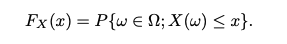

# Random Variables and Distribution Function

### What is a Random Variable ?

    A random variable is a real valued function from the probability space.
    
For example, flip a coin 332 times. Then the number of outcomes is more than a google (10100) – a number at least 100 quintillion times the number of elementary particles in the known universe. We may not be interested in an analysis that considers separately every possible outcome but rather some simpler concept like the number of heads or the longest run of tails. To focus our attention on the issues of interest, we take a given outcome and compute a number. This function is called a **random variable** .

X : Ω -> R

Notations : X, Y, Z for random variables. The range S of a random variable is sometimes called the *state space*.

### What is a Distribution Function ?

A (cumulative) distribution function of a random variable X is defined by

Reference - 

[Random Variables and Distribution Function](https://www.math.arizona.edu/~jwatkins/G_randomvariables.pdf) 
