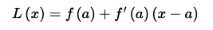

# Linearization
### What is Linearization ?
      (Linear approximation)

Functions can be complicated. Often, it is useful to replace a function by a simpler function. Today we will discuss one way to approximate a function and look at how to use this linearization to approximate functions and also when this is a bad idea. Given a differentiable function f defined near a, the linearization of *f* at a is the linear function given by

Or,

Given a function, 
f(*x*), we can find its tangent at  x = a . The equation of the tangent line, which we’ll call 
L(*x*) for this discussion, is,

Take a look at the following graph of a function and its tangent line.

From this graph we can see that near x = a the tangent line and the function have nearly the same graph. On occasion we will use the tangent line, L(x), as an approximation to the function, f(x), near x = a. In these cases we call the tangent line the **linear approximation** to the function at x = a.

References - 
[One](http://tutorial.math.lamar.edu/Classes/CalcI/LinearApproximations.aspx)
[Two](http://www.ms.uky.edu/~rbrown/courses/ma113.f.12/l24-linear.pdf)

